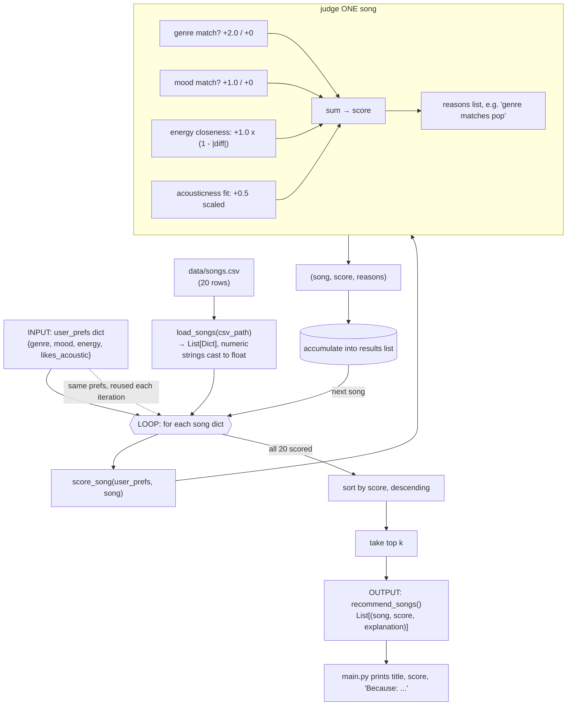

# Data Flow Sketch: Input → Process → Output

Planning sketch for `src/recommender.py` before implementation. Traces how a
single song moves from the CSV to a ranked recommendation list.

## Single-song trace

Sunrise City's CSV row (`pop, happy, energy=0.82, acousticness=0.18`) is
loaded as a dict, enters the loop, and is judged by `score_song`:

- genre: `pop == pop` → **+2.0**
- mood: `happy == happy` → **+1.0**
- energy closeness: `1 - |0.82 - 0.80|` → **+0.98**
- acousticness: low acousticness + `likes_acoustic=False` → **+0.41**
- total → **4.39**, with a `reasons` list explaining each component

That `(song, score, reasons)` tuple is appended to a results list alongside
the other 19 songs' tuples.

## Key point

`score_song` only ever sees **one song at a time** — it has no idea what the
other songs scored. Sorting/ranking is a separate second pass that can't
start until *every* song has a tuple in hand. That's the "judge one → rank
all" split described in the algorithm recipe.

## Weighting scheme (see prior discussion)

| Component | Type | Points | Formula |
|---|---|---|---|
| Genre match | binary | +2.0 | `2.0 if song.genre == favorite_genre else 0` |
| Mood match | binary | +1.0 | `1.0 if song.mood == favorite_mood else 0` |
| Energy closeness | continuous | up to +1.0 | `1.0 * (1 - abs(song.energy - target_energy))` |
| Acousticness fit | continuous | up to +0.5 | `0.5 * song.acousticness` if `likes_acoustic` else `0.5 * (1 - song.acousticness)` |

Max possible score: **4.5**.
